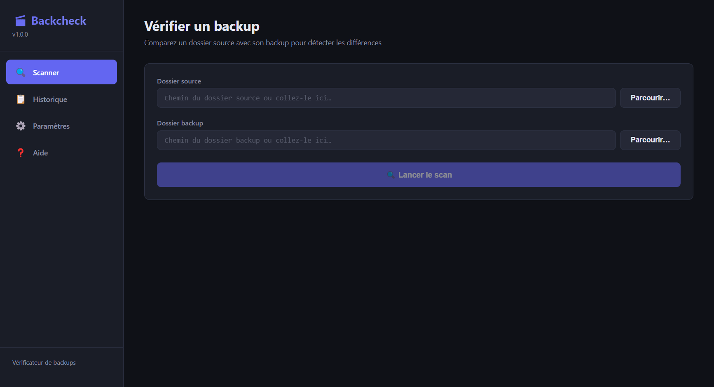
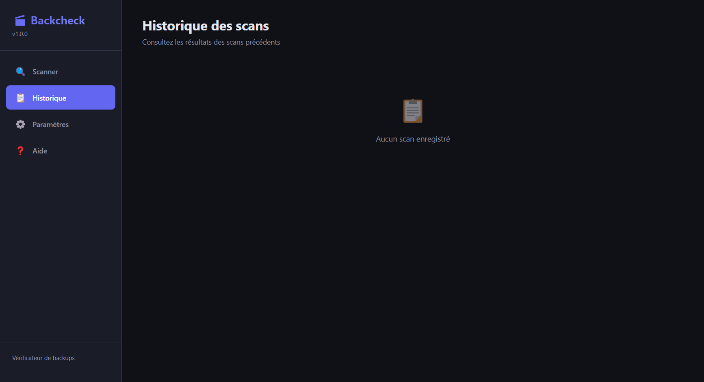
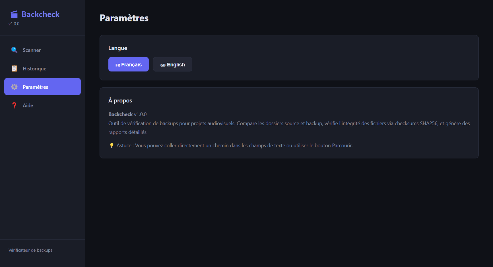
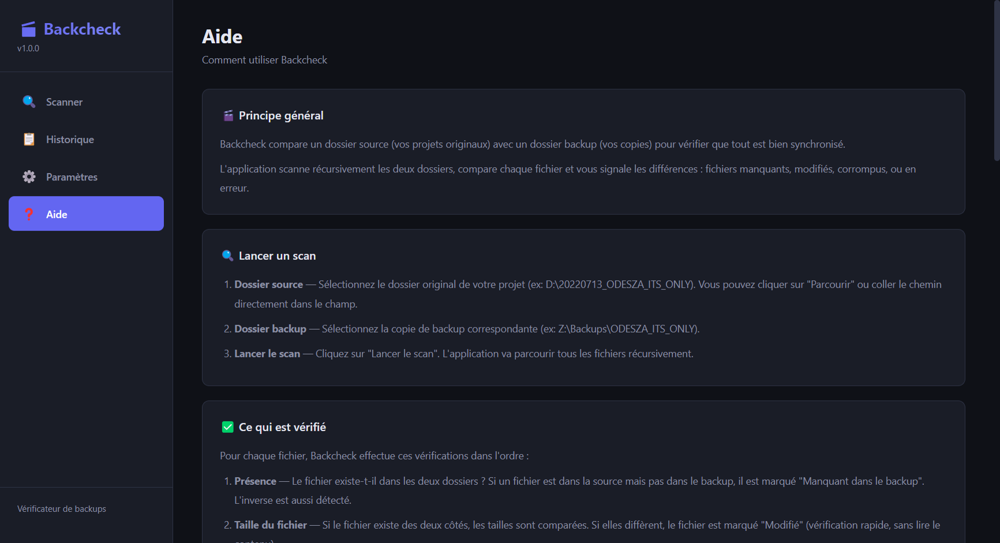

# Backcheck

**Vérificateur de backups audiovisuels** — Vérifiez que vos projets sont bien sauvegardés.


---

## 🎬 Pourquoi Backcheck ?

Vous travaillez dans l'audiovisuel ? Vous avez des dizaines de projets sur plusieurs disques durs et un NAS ? **Comment être sûr que vos backups sont à jour et complets ?**

Backcheck scanne vos dossiers de projets et compare la source avec le backup pour trouver :
- ❌ Fichiers **manquants** dans le backup
- 🔄 Fichiers **modifiés** (taille ou contenu différent)
- 🗑️ Fichiers **orphelins** (présents dans le backup mais plus dans la source)
- ✅ Fichiers **synchronisés**

---

## ✨ Fonctionnalités

### Scan intelligent
- **Comparaison rapide** — par taille de fichier (instantané)
- **Comparaison approfondie** — checksum SHA-256 (détection de corruption)
- **Progression temps réel** — barre de progression avec 4 phases

### Sync backup
- **Copie automatique** — transfère les fichiers manquants/modifiés vers le backup
- **Suppression des orphelins** — nettoie les fichiers obsolètes du backup
- **Confirmation obligatoire** — jamais de suppression sans votre accord

### Historique
- **SQLite** — stocke tous les scans dans une base de données locale
- **Comparaison** — voyez l'évolution entre deux scans
- **Recherche** — retrouvez rapidement un scan passé

### Rapports
- **HTML** — cartes de résumé stylisées + table détaillée
- **PDF** — export pour archivage ou partage

### Interface
- **Dark theme** — confort visuel pour les longues sessions
- **i18n** — français et anglais
- **Page d'aide** — 9 sections pour comprendre chaque fonction

---

## 📸 Captures d'écran

### Page Scan


### Page Historique


### Page Paramètres


### Page Aide


---

## 🚀 Installation

### Prérequis
- Windows 10/11 (64-bit)
- Node.js 18+ (pour le développement)

### Utilisateur final
1. Téléchargez `Backcheck-1.1.0-portable.exe` depuis les [Releases](https://github.com/Nody-G/back_check/releases)
2. Double-cliquez pour lancer (pas d'installation nécessaire)

### Développeur
```bash
# Cloner le repo
git clone https://github.com/Nody-G/back_check.git
cd back_check

# Installer les dépendances
npm install

# Lancer en mode développement
npm start

# Build pour production
npm run package
```

---

## 🛠️ Stack technique

| Composant | Technologie |
|-----------|-------------|
| Framework | Electron 33 |
| UI | React 18 |
| Langage | TypeScript |
| Bundler | Vite 6 |
| Base de données | sql.js (WASM) |
| Rapports | HTML + PDF (printToPDF) |

---

## 📁 Structure du projet

```
backcheck/
├── electron/              # Processus principal (Node.js)
│   ├── main.ts            # Création fenêtre, handlers IPC
│   ├── scanner.ts         # Moteur de scan SHA-256
│   ├── database.ts        # SQLite (sql.js)
│   ├── report.ts          # Générateur de rapports
│   ├── preload.ts         # Context bridge
│   └── types.ts           # Types partagés
├── src/                   # Interface (React)
│   ├── App.tsx            # Routeur
│   ├── components/        # Composants réutilisables
│   └── pages/             # Pages (Scan, Historique, Aide...)
├── dist/                  # Build Vite
├── dist-electron/         # Code Electron compilé
└── release/               # Exécutables
```

---

## 📖 Utilisation

### Scanner un projet
1. Sélectionnez le **dossier source** (votre projet original)
2. Sélectionnez le **dossier backup** (NAS, disque dur externe...)
3. Choisissez le mode :
   - **Rapide** — compare les tailles de fichiers
   - **Approfondi** — vérifie le contenu avec SHA-256
4. Cliquez sur **Lancer le scan**

### Synchroniser le backup
1. Après un scan, cliquez sur **Sync backup**
2. Consultez la liste des actions proposées
3. Confirmez pour lancer la copie/suppression

### Voir l'historique
1. Allez dans **Historique**
2. Cliquez sur un scan passé pour voir les détails
3. Comparez avec un scan précédent

---

## ⚙️ Configuration

Backcheck stocke ses préférences dans :
- **Langue** : localStorage (FR/EN)
- **Historique** : SQLite dans le dossier utilisateur

Aucune configuration externe requise.

---

## 🐛 Bugs connus

- Les warnings GPU cache ("Unable to move the cache") sont normaux et inoffensifs
- Le fichier WASM de sql.js doit être accessible à l'exécution

---

## 🤝 Contribuer

Les contributions sont les bienvenues !

1. Fork le projet
2. Créez une branche (`git checkout -b feature/AmazingFeature`)
3. Committez (`git commit -m 'Add AmazingFeature'`)
4. Push (`git push origin feature/AmazingFeature`)
5. Ouvrez une Pull Request

---

## 📝 Changelog

### v1.1.0 (2026-07-19)
- ✨ Progression du scan en temps réel (4 phases)
- ✨ Synchronisation backup (copie/supprime avec confirmation)
- ✨ Page d'aide (9 sections)
- ✨ i18n complet (FR/EN)
- 🐛 Correction doublon i18n
- 🐛 Correction ELECTRON_RUN_AS_NODE

### v1.0.0 (2026-07-19)
- 🎉 Première version
- Scan récursif avec comparaison taille + SHA-256
- Historique SQLite
- Rapports HTML/PDF
- Dark theme

---

## 📄 Licence

Ce projet est sous licence MIT. Voir le fichier [LICENSE](LICENSE) pour plus de détails.

---

## 🙏 Remerciements

- [Electron](https://www.electronjs.org/)
- [React](https://react.dev/)
- [Vite](https://vitejs.dev/)
- [sql.js](https://github.com/sql-js/sql.js)

---

## 📧 Contact

Niels — [@Nody-G](https://github.com/Nody-G)

Lien du projet : [https://github.com/Nody-G/back_check](https://github.com/Nody-G/back_check)
